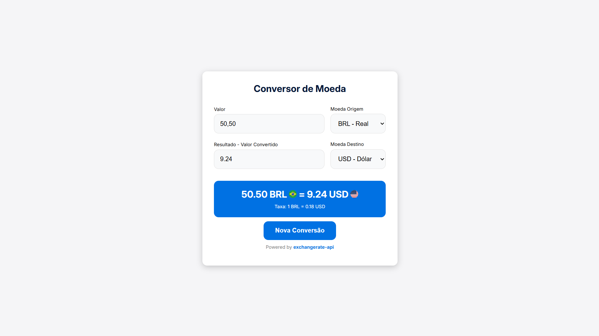

# Currency Converter with Country Flags



A modern and responsive currency converter application built with vanilla JavaScript, utilizing the ExchangeRate API and API Ninjas for country flags. Based on DevClub's tutorial by Rodolfo, with additional features including country flag visualization.

## 🚀 Features

- Real-time currency conversion with 10 major currencies:
  - USD (US Dollar)
  - EUR (Euro)
  - BRL (Brazilian Real)
  - GBP (British Pound)
  - And more...
- Dynamic country flag display for each currency
- Live exchange rate information
- Loading states with spinner animation
- Error handling with user feedback
- Clean and intuitive interface

## 💻 Technologies Used

- HTML5
- CSS3 (with Flexbox and modern animations)
- Vanilla JavaScript (ES6+)
- ExchangeRate API
- API Ninjas for country flags
- Responsive Design
- Google Fonts (Inter)

## 🌟 Key Improvements Over Tutorial

- Added country flags visualization using API Ninjas
  
## 🎨 Design Features

- Clean and minimalist interface
- Interactive form elements
- Smooth animations and transitions
- Loading spinner animation
- Error state visualization
- Responsive layout for all devices
- Dynamic flag display

## 🛠️ Installation

1. Clone the repository:
```bash
git clone https://github.com/yourusername/currency-converter-flags.git
```

2. Navigate to project directory:
```bash
cd currency-converter-flags
```

3. Open `index.html` in your browser

## 🔧 Usage

1. Enter the amount to convert
2. Select source currency
3. Select target currency
4. Click "Converter Moeda"
5. View result with country flags
6. Click "Nova Conversão" to start over

## 🔑 API Keys Required

To use this project, you'll need:
- ExchangeRate API key
- API Ninjas key for flag images

## 📱 Responsive Design

- Desktop and larger screens
- Tablet devices
- Mobile devices
- Consistent experience across all sizes

## 🙏 Credits

- Original tutorial by [Rodolfo - DevClub](https://www.youtube.com/watch?v=RBRybGiw6KM)
- ExchangeRate API
- API Ninjas
- Inter font by Google Fonts

## 👨‍💻 Author

- GitHub: [@ViniciusG1m3n3s](https://github.com/ViniciusG1m3n3s)
- LinkedIn: [Vinícius Gimenes](http://www.linkedin.com/in/vinícius-gimenes-7bba93199)

## 📝 License

This project is open source and available under the
